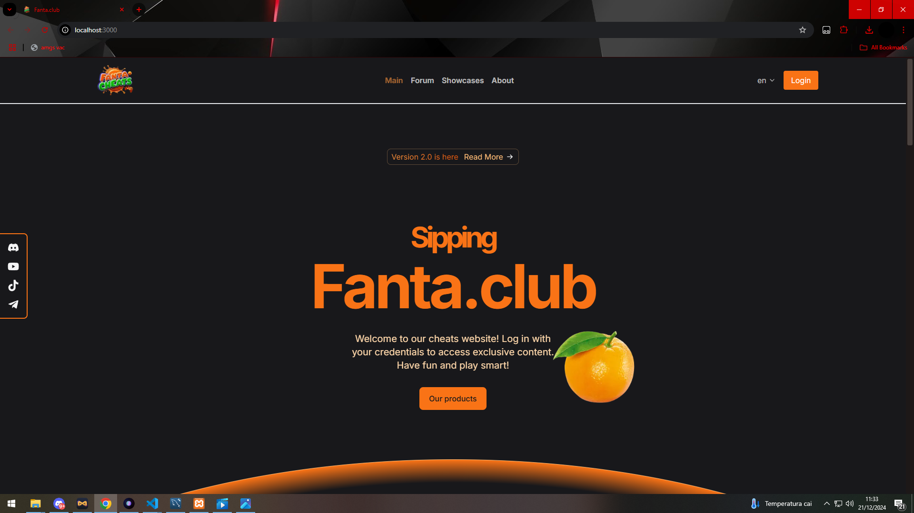
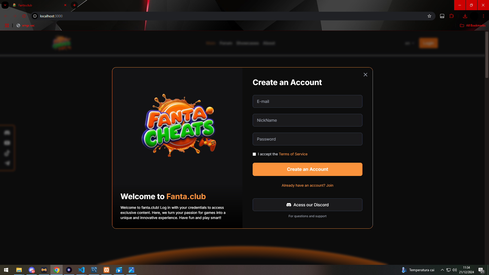
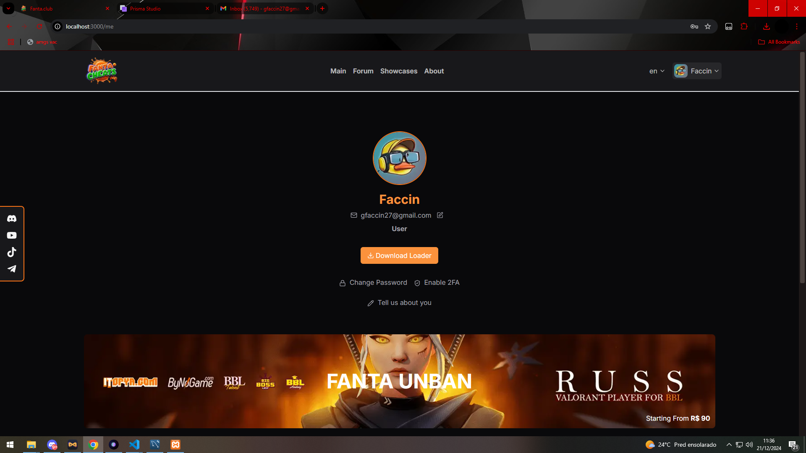

# Fanta.club - Social and Showcase Platform

**Fanta.club** é uma plataforma multifuncional que combina um sistema de fóruns, showcases personalizados, gerenciamento de compras e autenticação segura com confirmação por e-mail. Desenvolvida com tecnologias modernas como **React**, **Next.js** e **Tailwind CSS**, a interface proporciona uma experiência intuitiva e agradável para os usuários.



## Funcionalidades

### 🔐 Autenticação de Usuário

- **Login e Registro**: Sistema seguro e intuitivo para autenticação.
- **Confirmação de E-mail**: Validação do e-mail para garantir contas legítimas.



### 📋 Fóruns

- **Anuncios**: Para anúncios sobre diversos assuntos do mercado.
- **Updates**: Para atualizações de nossos produtos.
- **Configs**: Para todos os usuarios clientes postarem conteudo.
- **Questions**: Para perguntas frequentemente feitas.


### 🌟 Sistema de Showcase

- **Exposição Personalizada**: Sistema com filtro para usuarios e para plataformas como youtube e tiktok


### 🛒 Gerenciamento de Compras

- **Sistema de Compras**: Plataforma integrada para realizar compras com eficiência.
- **Histórico de Compras**: Visualize e gerencie compras realizadas.


### 📧 Confirmação por E-mail

- **Validação de Login/Registro**: Confirme o e-mail para acesso seguro e confiável.
- **Recuperação de Senha**: Sistema simples para redefinição de senhas por e-mail.

### 📊 Painel de Controle

- **Dashboard Intuitivo**: Gerencie suas atividades na plataforma de forma clara e eficiente.



## Tecnologias Utilizadas

- **Front-end**:
  - React com TypeScript
  - Next.js para renderização de páginas
  - Tailwind CSS para estilização
  - Framer Motion para animações
  - Lucide-react para ícones
  - Axios para requisições HTTP
  - DOMPurify para sanitização de HTML
  - i18next para internacionalização do site
  - Sharp para conversão de imagens
  
- **Back-end**:
  - Fastify para gerenciamento de rotas
  - Prisma ORM para interação com o banco de dados MySQL
  - Veja mais no repositorio [back-end](https://github.com/Faccin27/Fanta.club-backend).

## Como Rodar o Projeto

1. Clone este repositório:

   ```bash
   git clone https://github.com/Faccin27/Fanta.club
   ```

2. Instale as dependências:

   ```bash
   npm install
   ```

3. Rode o projeto:

   ```bash
   npm run dev
   ```

4. Acesse o projeto no navegador:
   ```
   http://localhost:3000
   ```

## Repositório do Back-end

Você pode acessar o repositório do back-end do projeto [aqui](https://github.com/Faccin27/Fanta.club-backend).

## Contribuições

Contribuições são bem-vindas! Sinta-se à vontade para abrir um PR ou relatar problemas.

